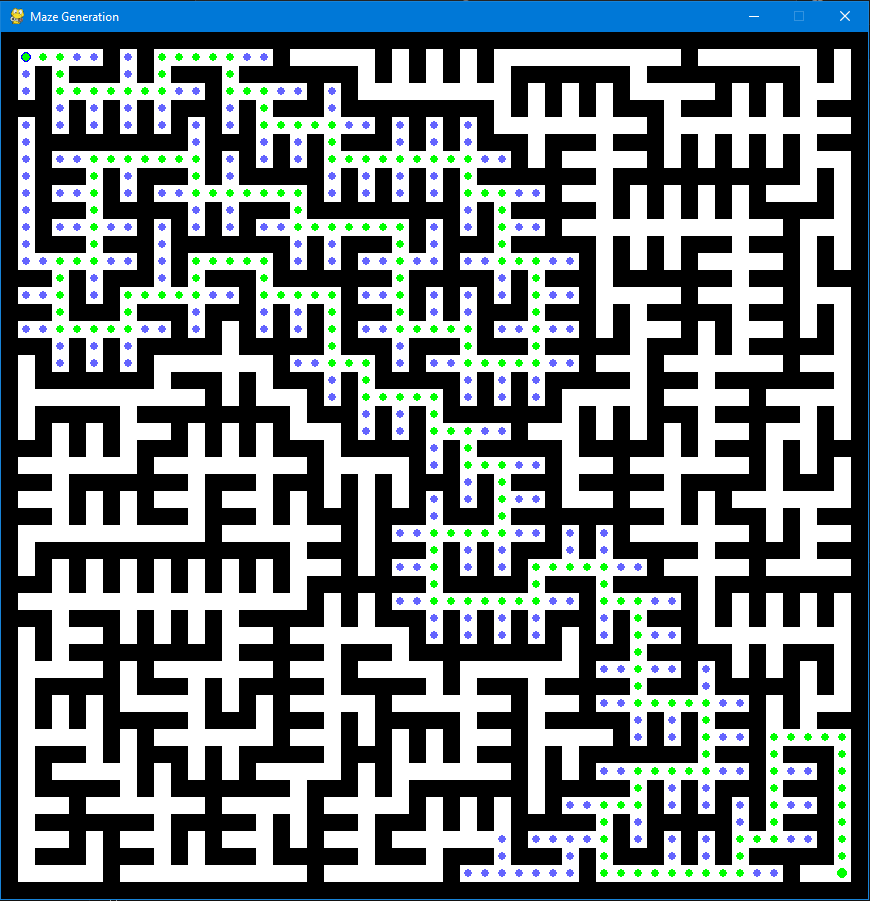
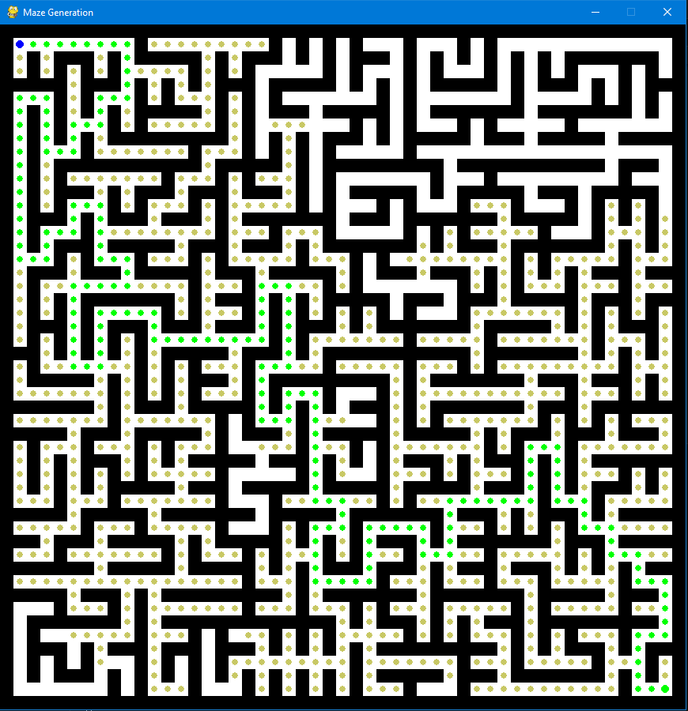
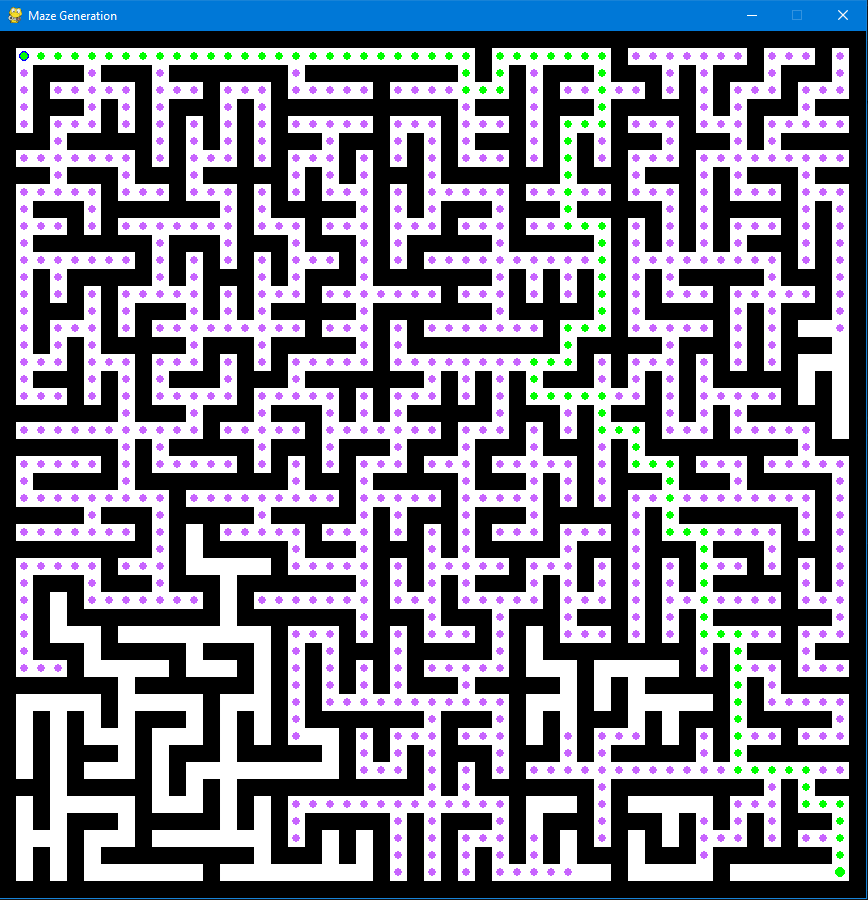

# 🧠 MazeSolver

MazeSolver is a Python-based visualization tool for generating and solving mazes using multiple classical algorithms. It supports animation, pathfinding visualization, and is structured for easy experimentation and extension.


---

## 🔧 Features

- 6 Maze Generation Algorithms
- 6 Maze Solving Algorithms
- Pygame-powered real-time visualization
- Command-line interface for easy experimentation
- Modular structure for adding new algorithms
- (Coming Soon) GUI with sidebar controls and save/export options

---

## 🎲 Maze Generation Algorithms

Each generator creates a *perfect maze* — meaning one unique path exists between any two points.

1. **DFS Backtracker** – Depth-first traversal, produces twisty paths
2. **Prim’s Algorithm** – Builds out from walls, yields dense, branching mazes
3. **Wilson’s Algorithm** – Loop-erased random walks, yields uniform randomness
4. **Recursive Division** – Carves passages through subdivided regions
5. **Hunt and Kill** – Alternates random walks with deterministic scanning
6. **Kruskal’s Algorithm** – Uses a randomized spanning tree, very natural structure

| Algorithm | Example |
|----------|---------|
| DFS Backtracker | |
| Recursive Division |  |
| Kruskal’s |  |

---

## 🚀 Maze Solving Algorithms

Solvers animate their search and highlight the final path in green.

1. **A\*** – Efficient heuristic search using both path cost and estimated distance
2. **Dijkstra** – Uniform-cost search for optimal paths in weighted graphs
3. **Breadth-First Search (BFS)** – Explores all nodes at one level before moving deeper
4. **Greedy Best-First Search** – Always chooses the node closest to the goal
5. **Depth-First Search (DFS)** – Explores as far as possible along each path
6. **Bidirectional Search** – Simultaneous search from start and goal

| Solver | Visualization |
|--------|----------------|
| A\* |  |
| Dijkstra |  |
| BFS |  |

---

## 🧪 Usage

### Requirements
- Python 3.10+
- `pygame` (`pip install pygame`)

### Run from Command Line

```bash
python main.py --algo 2 --size 30 --solve 3
```

**Arguments:** 

- `--algo: Maze generator (1–6)`
- `--size: Maze dimensions (NxN)`
- `--solve: Solver algorithm (1–6) (optional)`

**Examples:**

```bash
python main.py --algo 4 --size 40 --solve 1
```

**Requirements:**

```bash
pygame>=2.0
numpy>=1.21
```

### 🗺 Roadmap

 - GUI with algorithm selectors, input validation, and control buttons

 - Maze export as PNG (before and after solving)

 - Support for mazes with multiple goals

 - Stylized maze wall rendering and aesthetic enhancements

 - “Image-to-maze” AI experiment

 ### 📁 Directory Structure

 ```css
 MazeSolver/
├── main.py
├── solvers/
│   ├── a_star.py
│   ├── dijkstra.py
│   └── ...
├── maze_generators/
│   ├── dfs_backtracker.py
│   └── ...
├── visualizer/
│   └── pygame_renderer.py
└── README.md
```

### 🧠 License & Acknowledgments

MIT License - Open-source for learning, experimentation, and demo purposes.
Inspired by classic pathfinding visualizations and CS fundamentals.

