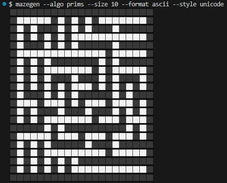
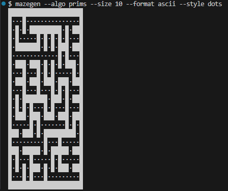
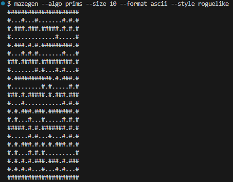

# 🧠 MazeSolver

<table><tr>
<td width="50%" valign="top">

MazeSolver is a Python-based visualization tool for generating and solving mazes using multiple classical algorithms. It supports animation, pathfinding visualization, and is structured for easy experimentation and extension.

</td>
<td>


</td>
</tr></table>

---

## ⚙️ Command-Line Interface (CLI)

In addition to the graphical interface, MazeSolver includes a fully functional CLI utility: `mazegen`, designed for scriptable generation and export of mazes.

### 🔧 Features

* Generate mazes using any of 6 algorithms
* Output formats: `ascii`, `json`, or `npy`
* Optional metadata output
* Customizable ASCII styles

### ✅ Usage

```bash
# Install locally in development mode
pip install -e .

# Run CLI from source (safe and portable)
python -m mazegen.cli --algo recdiv --size 31 --format ascii

# Optional alias for convenience
alias mazegen="python -m mazegen.cli"
```

### 📜 Arguments

* `--algo`: Algorithm name (`dfs`, `prims`, `wilsons`, `recdiv`, `handk`, `kruskals`)
* `--size`: Maze width/height (must be odd). Logical size of the maze (NxN); actual output will be (2N+1)×(2N+1) to include walls
* `--format`: Output format: `ascii`, `json`, or `npy`
* `--output`: Save output to file (optional)
* `--style`: For ASCII format — `blocks`, `dots`, `unicode`, `roguelike`
* `--save-meta`: Store generation metadata as `.meta.json`

### 🗈 Output Examples

| Style     | Sample                       |Style     | Sample                       |
| --------- | ---------------------------- | --------- | ---------------------------- |
| **Blocks**     |      | **Unicode**   |     |
| **Dots**      |        | **Roguelike** |   |


```text
$ mazegen --algo prims --size 20 --format ascii
pygame 2.6.1 (SDL 2.28.4, Python 3.11.0)
█████████████████████████████████████████
█░░░░░█░░░░░░░█░█░█░░░░░░░░░░░░░█░█░░░░░█
█░█░███░█████░█░█░█░█████░█░█████░█░█████
█░█░░░░░█░█░█░░░░░░░░░░░█░█░█░░░░░█░░░░░█
███░█░███░█░█████████░█░█░███░█░█░█░█████
█░░░█░░░░░░░░░░░█░█░█░█░█░█░░░█░█░░░░░░░█
█░█░█████░███░███░█░███░███░█████████████
█░█░░░░░█░█░░░░░░░█░█░█░░░░░░░░░░░░░░░░░█
█░███░███░███░███░█░█░█████░███░███░█░███
█░░░█░█░░░█░░░░░█░░░░░░░░░█░░░█░█░█░█░█░█
█░█████░█░███░███░█████░█████████░█░███░█
█░█░░░░░█░░░█░░░█░░░░░█░░░░░░░░░█░█░█░░░█
███░█░█░█░███░█░█████████░█████░█░███░█░█
█░█░█░█░█░█░░░█░█░░░░░░░█░░░░░█░░░░░█░█░█
█░███░███░█████░█░█████████░███░█░█████░█
█░░░░░░░█░█░░░░░░░░░░░░░░░█░█░█░█░█░█░░░█
█░███░█████░█░█░███████░█████░█████░███░█
█░░░█░█░█░░░█░█░░░░░█░░░░░░░░░░░░░░░░░░░█
█░█████░█████░███░█░███░█░█████████░█░███
█░█░█░░░░░░░░░█░░░█░░░█░█░█░░░█░█░░░█░░░█
█░█░███░█░█░███░███░█████████░█░█░█░█░█░█
█░█░█░░░█░█░░░█░░░█░░░░░█░█░█░█░█░█░█░█░█
███░█░█████░█████░███████░█░█░█░███░███░█
█░░░░░█░░░░░░░█░░░░░█░░░█░█░░░█░░░█░░░█░█
███░███░█████░███░█░█░███░█░█░█░█████████
█░░░░░█░█░░░░░█░░░█░░░░░░░░░█░░░█░░░░░░░█
█░█░███░█████████░█░█░█░█░█░█░███░█░█░█░█
█░█░░░█░█░█░░░░░░░█░█░█░█░█░█░░░░░█░█░█░█
███░█░███░█░█░█░███░█░█░███░█░███████████
█░░░█░█░█░░░█░█░░░█░█░█░░░█░█░░░░░█░░░░░█
█░█░█░█░███░███░█░███░█████████░█░███░███
█░█░█░█░░░░░█░░░█░█░░░░░░░░░░░█░█░░░░░░░█
███░█████░███░███░███░█░█░█░█░███████░█░█
█░░░░░█░░░░░█░█░░░░░█░█░█░█░█░░░█░░░█░█░█
█░███░█░█░█░█░█░█░█░███░███░█░█░█░█░█████
█░█░░░█░█░█░█░█░█░█░█░░░█░░░█░█░░░█░█░░░█
█░█░█████░█████░█░█████░███░█░█░█░███░███
█░█░█░░░░░█░░░█░█░█░░░░░█░█░█░█░█░░░░░░░█
█░███████░█░███████░███░█░█░█████░███░█░█
█░░░░░█░░░░░░░█░░░░░█░░░░░█░░░░░█░░░█░█░█
█████████████████████████████████████████
(.venv)
```

---

## 🔧 Features

* 6 Maze Generation Algorithms
* 6 Maze Solving Algorithms
* Pygame-powered real-time visualization
* Command-line interface for easy experimentation
* Modular structure for adding new algorithms
* (Coming Soon) GUI with sidebar controls and save/export options

---

## 🎲 Maze Generation Algorithms

Each generator creates a *perfect maze* — meaning one unique path exists between any two points.

1. **DFS Backtracker** – Depth-first traversal, produces twisty paths
2. **Prim’s Algorithm** – Builds out from walls, yields dense, branching mazes
3. **Wilson’s Algorithm** – Loop-erased random walks, yields uniform randomness
4. **Recursive Division** – Carves passages through subdivided regions
5. **Hunt and Kill** – Alternates random walks with deterministic scanning
6. **Kruskal’s Algorithm** – Uses a randomized spanning tree, very natural structure

| Algorithm          | Example                                                                    |
| ------------------ | -------------------------------------------------------------------------- |
| **DFS Backtracker**    |            |
| **Recursive Division** |         |
| **Kruskal’s**          |  |

---

## 🚀 Maze Solving Algorithms

Solvers animate their search and highlight the final path in green.

1. **A\*** – Efficient heuristic search using both path cost and estimated distance
2. **Dijkstra** – Uniform-cost search for optimal paths in weighted graphs
3. **Breadth-First Search (BFS)** – Explores all nodes at one level before moving deeper
4. **Greedy Best-First Search** – Always chooses the node closest to the goal
5. **Depth-First Search (DFS)** – Explores as far as possible along each path
6. **Bidirectional Search** – Simultaneous search from start and goal

| Solver   | Visualization                                                      |
| -------- | ------------------------------------------------------------------ |
| **A\***     |    |
| **Dijkstra** |  |
| **BFS**      |     |

---

## 🧪 Usage

**Requirements:**

```bash
pygame>=2.0
numpy>=1.21
```

**Installation**

```bash
git clone git@github.com:Drew-Woodz/MazeSolver.git
cd MazeSolver
python -m venv .venv
source .venv/Scripts/activate  # On Windows
# or
source .venv/bin/activate      # On Mac/Linux

pip install pygame numpy
```

**Run from Command Line**

```bash
python main.py --algo 2 --size 30 --solve 3
```

**Arguments:**

* `--algo: Maze generator (1–6)`
* `--size: Maze dimensions (NxN)`
* `--solve: Solver algorithm (1–6) (optional)`

**Examples:**

```bash
python main.py --algo 4 --size 40 --solve 1
```

### 📌 Roadmap

* GUI with algorithm selectors, input validation, and control buttons

* Maze export as PNG (before and after solving)

* Support for mazes with multiple goals

* Stylized maze wall rendering and aesthetic enhancements

* “Image-to-maze” AI experiment

### 📁 Directory Structure

```css
MazeSolver/
├── main.py
├── maze_generators/
│   ├── dfs.py
│   └── ...
├── mazegen/
│   ├──cli.py
│   └──interface.py
├── solvers/
│   ├── a_star.py
│   ├── dijkstra.py
│   └── ...
├── visualizer/
│   └── pygame_renderer.py
└── README.md
```

### 🧠 License & Acknowledgments

MIT License - Open-source for learning, experimentation, and demo purposes.
Inspired by classic pathfinding visualizations and CS fundamentals.
